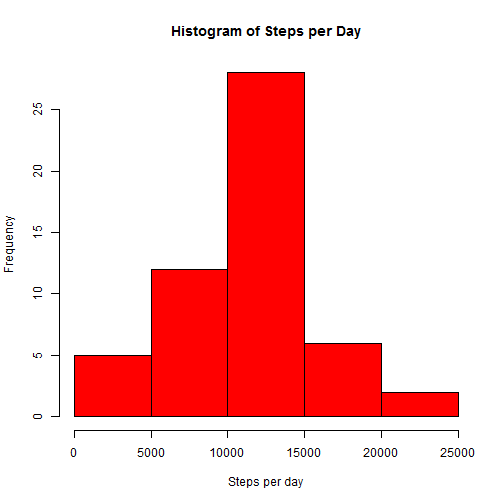
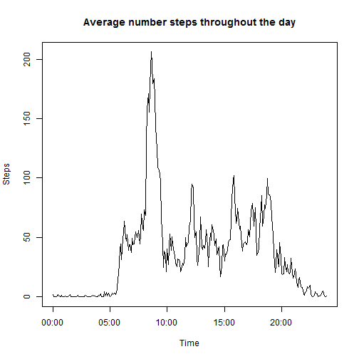
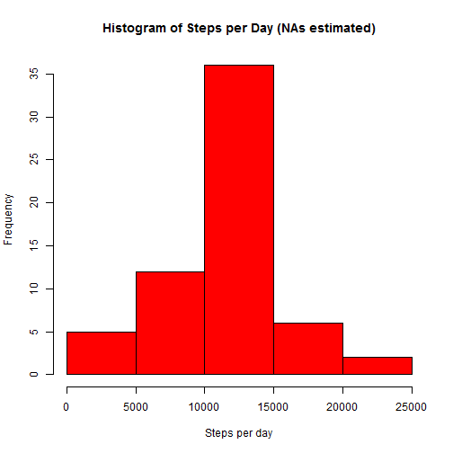
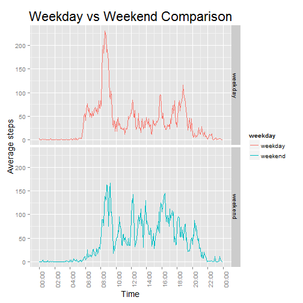

Reproducible Research - Assignment 1
=====================================
The following file performs an analysis on data extracted from a personal activity monitoring device. This device collects data at 5 minute intervals throughout the day. The data consists of two months of data from an anonymous individual collected during the months of October and November, 2012 and include the number of steps taken in 5 minute intervals each day.

The data for this analysis can be downloaded here:
https://d396qusza40orc.cloudfront.net/repdata%2Fdata%2Factivity.zip

For this analysis, we assume that the data has been downloaded and saved as a csv file named "activity.csv" in your current working directory.

###Loading and Preprocessing the Data
The following code is used to read the data into your R frontend and processes some of the variables for ease of use later on in the analysis.

* The interval times are converted to include the leading zeros, e.g. from 5 to 0005.
* The date variable is converted into a date format.


```r
orig_data= read.csv("activity.csv")
data=orig_data
data$interval = sprintf("%04d", data$interval)
data$date= as.Date(data$date, format = "%Y-%m-%d")
options(scipen=5)
```

###What is mean total number of steps taken per day?
The sum of the total numbers of steps taken per day in the timeframe is calculated below and plotted in a histogram:


```r
steps_per_day = aggregate(data$steps, list(data$date), sum)
hist(steps_per_day[,2], col = 2,xlab = "Steps per day", main="Histogram of Steps per Day")
```

 

The code used to calculate the mean and median number of steps per day is shown below:

```r
summary(steps_per_day[,2])
```

```
##    Min. 1st Qu.  Median    Mean 3rd Qu.    Max.    NA's 
##      41    8841   10760   10770   13290   21190       8
```
Note that the summary function used above rounds the answer to the nearest 10, to have a look at a slightly more accurate number, the code below was used:


```r
m1=round(mean(steps_per_day[,2],na.rm=TRUE),2)
q2=quantile(steps_per_day[,2],0.5, na.rm=TRUE)
```

The mean is 10766.19  and the median is 10765 which is supported by the histogram above.

###What is the average daily activity pattern?
The following shows a time series plot of the 5-minute interval (x-axis) and the average number of steps taken, averaged across all days (y-axis).


```r
steps_per_five_ave = aggregate(data$steps, list(data$interval), mean, na.rm=TRUE)
names(steps_per_five_ave)=c("interval","Ave_steps")
merged_data=merge(x=data,y=steps_per_five_ave, by = "interval", all.x = TRUE)

steps_per_five_ave$interval2= strptime(steps_per_five_ave$interval,"%H%M")

#timeseries of average steps per 5 minutes
plot(steps_per_five_ave$interval2,steps_per_five_ave$Ave_steps, type="l", xlab="Time", ylab="Steps", main="Average number steps throughout the day")
```

 

We can see from this plot that the maximum number of steps seem to be taken in the morning between 8 and 9. To find the exact time or 5-minute interval at which the maximum number of steps is taken the following code is used:


```r
t1=steps_per_five_ave[steps_per_five_ave$Ave_steps==max(steps_per_five_ave[,2]),]
t2=t1$interval
s2=round(t1$Ave_steps,2)
```

This maximum occurs at 0835 o'clock and the maximum average of steps is 206.17 which is well in line with our initial expectation.

##Imputing missing values

Up until this point, the missing values have been ignored in the analysis. For the following section, we want to estimate the missing values with a sensible approximation. The approximation that we will make is that any missing value, will be replaced by the average of that 5-minute time interval number of steps. This approximation seem to be sensible as one would expect a reasonably consistent walking pattern throughout the day.

First we would like to see how many missing values there are in the dataset:


```r
sum(is.na(data$steps))
```

```
## [1] 2304
```

We now create a new data set with the missing values replaced with average steps for the five minute interval as described in the introduction to this section.


```r
merged_data$steps2=ifelse(is.na(merged_data$steps)==TRUE, merged_data$Ave_steps,merged_data$steps)
data2 = merged_data[,c("steps2","date","interval")]
names(data2)=names(orig_data)
```

Comparing this new dataset to the original dataset containing the missing values, we compute the mean and median, and graph a histogram of the total steps per day as in the first secton in this analysis above:


```r
steps_per_day2 = aggregate(data2$steps, list(data2$date), sum)
hist(steps_per_day2[,2], col = 2,xlab = "Steps per day", main="Histogram of Steps per Day (NAs estimated)")
```

 

```r
summary(steps_per_day2[,2])
```

```
##    Min. 1st Qu.  Median    Mean 3rd Qu.    Max. 
##      41    9819   10770   10770   12810   21190
```

```r
mean(steps_per_day2[,2],na.rm=TRUE)
```

```
## [1] 10766.19
```

```r
quantile(steps_per_day2[,2],0.5, na.rm=TRUE)
```

```
##      50% 
## 10766.19
```

Comparing this histogram to the original one above, you can see that the frequency of days that have around the mean number of steps has increased significanltly. This is to be expected as we used a mean approximation for the missing values. Also, we can see that the new mean and median are identical, whereas in the original dataset, there was a slight difference between the mean and the median, indicating a slightly skewed distribution.

##Are there differences in activity patterns between weekdays and weekends?

To analyse this question, we first create a new factor variable in the dataset with two levels - "weekday" and "weekend" indicating whether a given date is a weekday or weekend day.


```r
data2$weekday = ifelse((substr(weekdays(data2$date),1,1)=="S"), "weekend","weekday")
```

To get the new data into the correct format for the plot, the following was used:


```r
data_weekday = subset(data2, weekday=="weekday")
data_weekend = subset(data2, weekday=="weekend")

steps_per_five_ave_weekday = aggregate(data_weekday$steps, list(data_weekday$interval), mean, na.rm=TRUE)
steps_per_five_ave_weekday$weekday = "weekday"
names(steps_per_five_ave_weekday)=c("interval","Ave_steps","weekday")

steps_per_five_ave_weekend = aggregate(data_weekend$steps, list(data_weekend$interval), mean, na.rm=TRUE)
steps_per_five_ave_weekend$weekday = "weekend"
names(steps_per_five_ave_weekend)=c("interval","Ave_steps","weekday")

data3= rbind(steps_per_five_ave_weekend,steps_per_five_ave_weekday)
data3$weekday=as.factor(data3$weekday)
data3$interval2= strptime(data3$interval,"%H%M")
```

The code above performs the following steps:

* Subsets the data to weekday and weekend, so that manipulations and calculations can be performed on the datasets separately.
* Calculates the average steps per 5 minute interval for the two datasets.
* Combines the datasets into one to use in the plot.
* Converts the weekday variable into a factor variable and creates a new time variable 'interval2' for the interval variable.

This new data is then used to plot the following:


```r
library(ggplot2)
library(scales)
g=ggplot(data3, aes(interval2, Ave_steps, color=weekday))+facet_grid(weekday~.)+geom_line()
g=g + theme(axis.text.x = element_text(angle = 90, hjust = 1), axis.title=element_text(size=14)) + theme(plot.title = element_text(size=22,face="bold"))
g=g + scale_x_datetime(breaks=date_breaks('2 hour'),labels = function(x) format(x,"%H:%M",tz="Africa/Johannesburg"))
g=g + labs(title=expression("Weekday vs Weekend Comparison"), x="Time", y="Average steps")
print(g)
```

 


The plot can be used to identify some interesting differentiaters between weekday and weekend activity. A couple of points to note:

* The time at which the maximum average steps is taken (that we observed earlier), clearly comes from the weekday activity.
* On average, excluding the spike, the average activity level seems to be higher on weekends than during the week.
* There is slightly more activity late at night over weekends, than during the week.
* On weekdays, the activity in the morning increased quite drastically, whereas on the weekend, the activity increases more gradually.

